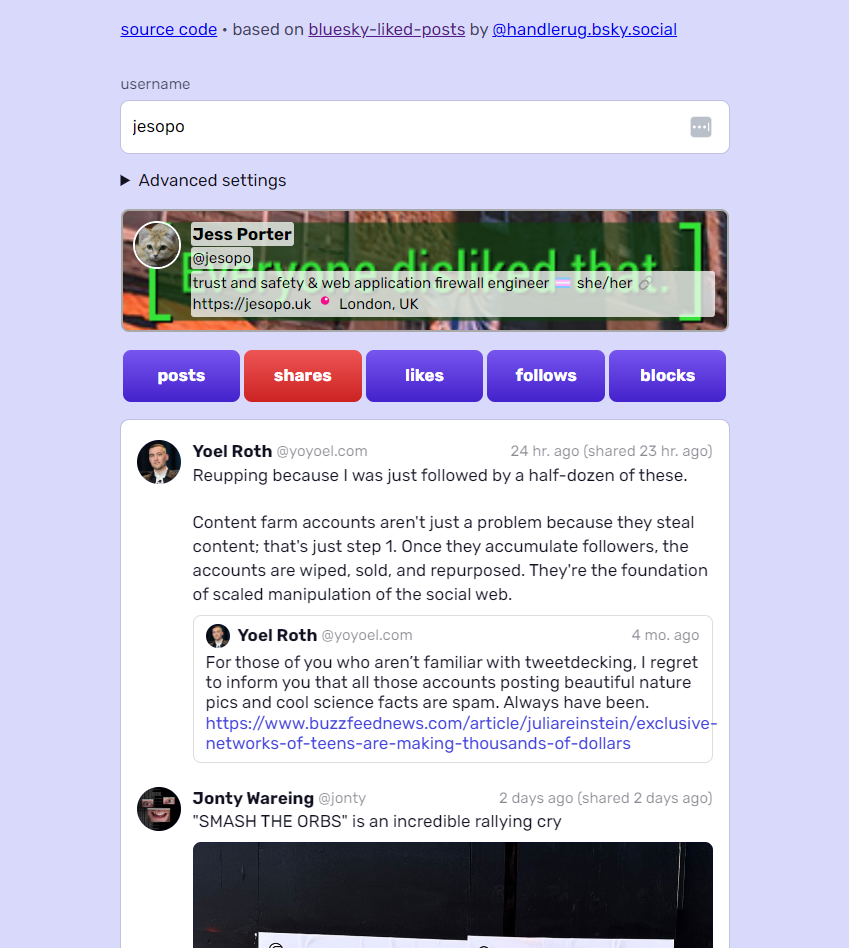

[bluesky viewer](https://bskyviewer.github.io/)

a web app that shows public data from bluesky

the data available without signing in is fairly limited. basically a user profile is treated by bsky as a repository containing all the information controlled by the user, and we can only fetch data from any single repository, so for example the list of accounts that a profile can be retrieved easily, but to get a list of followers without querying every single account that may be following you would need to sign in. you can however see all posts, reposts, likes, follows, and blocks performed by any user.



## Tech Stack

- [React](https://react.dev/) 19
- [Vite](https://vite.dev/) 6
- [TypeScript](https://www.typescriptlang.org/) 5
- [Tailwind CSS](https://tailwindcss.com/) 3
- [AT Protocol API](https://atproto.com/) (`@atproto/api` ^0.19.4)

## Development

```bash
npm install
npm run dev
```

## Build

```bash
npm run build
```
